# 🌍 Gemetra  
**Global Remittance Infrastructure for VAT Refunds & Payroll**  
Wallet-native. AI-powered. Borderless. Built on SOMNIA.  

---

## 🚀 Overview  

**Gemetra** is the **first on-chain VAT Refund & Payroll Payment Infrastructure** that operates without heavy smart contracts.  
Instead, it leverages:  
- **Algorand payment transactions**  
- **Pera Wallet** for seamless mobile signing  
- **AI orchestration** for payroll computation and VAT eligibility  
- **Supabase** for persistence, audit trails, and compliance exports  

Two killer use cases, unified under one infra:  
1. **VAT Refunds** – Tourists scan QR at departure → confirm in Pera Wallet → refund instantly in USDCa/ALGO.  
2. **Payroll Automation** – Employers upload CSV → AI computes net salaries + FX → HR scans one QR → employees are paid in seconds.  

---

## 🛑 Problem  

- **Tourist VAT Refunds** are slow, manual, and often unclaimed due to airport delays.  
- **Global Payroll** is plagued by high fees, delayed wires, hidden FX costs, and compliance overhead.  
- Both processes rely on **centralized, fragmented rails** that fail in a borderless world.  

---

## ✅ Solution  

**Gemetra** provides a **wallet-native remittance infra** where:  
- Tourists **receive VAT refunds** instantly in stablecoins.  
- Employers **disburse payroll globally** with a single scan.  
- Algorand ensures **finality in ~4s** and **ultra-low fees**.  

---

## ⚙️ How It Works  

### VAT Refund Flow  
1. Retailer issues invoice + VAT claim tag.  
2. Tourist opens Gemetra, uploads the invoice, flight ticket and VAT claim tag QR at any time, anywhere within 90 days.  
3. AI validate eligibility with the Operator system.  
4. Tourist confirms transfer in **Pera Wallet**.  
5. Refund delivered instantly in **USDC/ALGO**.  

### Payroll Flow  
1. Employer uploads payroll CSV.  
2. AI parses salaries, taxes, FX → generates `TxPlan[]`.  
3. Dashboard displays preview → CFO/HR scans one QR.  
4. Treasury wallet signs and sends **chunked atomic groups** (≤16 tx each).  
5. Employees receive stablecoin salaries instantly.  

---

## 🔮 Features  

- **Wallet-Native UX**: No contracts, no clunky DApps → just Pera Wallet scan + confirm.  
- **Tourism-Grade Simplicity**: Refunds in 2 steps → Scan QR → Confirm transfer.  
- **Enterprise Payroll**: AI-driven salary parsing, FX conversion, and bulk payouts.  
- **Transparency**: Tx notes embed `claim_id` and `payrun_id` for deterministic audits.  
- **Compliance Ready**: Supabase logs + JSON/CSV exports for regulators and finance teams.  
- **Scalability**: Chunked atomic transfers for thousands of recipients.  

---

## ⚡High-Level System Architecture

## ✅ VAT Refund – Airport Flow (fixed)

## ✅ Payroll – CSV to Batched Payouts

```mermaid

sequenceDiagram
  participant HR as Employer (HR/CFO)
  participant Dash as Employer Dashboard
  participant API as Gemetra API
  participant AI as AI Orchestrator
  participant FX as FX Oracle
  participant Supa as Supabase
  participant Pera as Pera Wallet (Treasury)
  participant Algo as Algorand Network
  participant Indexer as Algorand Indexer
  participant Emp as Employees (Wallets)

  HR->>Dash: Upload CSV / Contracts
  Dash->>API: Create payrun (payload)
  API->>AI: Parse salaries, taxes, net pay
  AI->>FX: Snapshot FX (USDCa/base)
  FX-->>AI: Rates
  AI-->>API: TxPlan[] (chunked ≤16 per group)
  API->>Supa: Save payrun + tx sets
  API-->>Dash: Preview totals, fees, FX

  HR->>Pera: Scan master QR (authorize)
  loop For each chunk (≤16)
    Pera->>Algo: Broadcast grouped transfers
    Algo-->>Pera: Group confirmed
    Pera->>API: Callback (group_id, txids)
    API->>Indexer: Verify confirmations
    Indexer-->>API: Confirmed
    API->>Supa: Mark chunk complete
  end

  note over Emp: Employees receive USDCa/ALGO instantly
  API-->>Dash: Payrun completed (txids, exports)

```

## ✅ Shared Transfer Intent

## 🛠️ Tech Stack  

- **Blockchain**: [Algorand](https://developer.algorand.org/)  
  – Fast finality, ultra-low fees, and stablecoin rails (USDCa).  

- **Wallet**: [Pera Wallet](https://perawallet.app/)  
  – Mobile-first signing with QR scan/deep link support.  

- **AI Layer**: [Bolt.new](https://bolt.new) + Gemini  
  – Salary parsing, jurisdictional tax/FX reasoning, transfer instruction generation.  

- **Backend**: [Supabase](https://supabase.com/)  
  – Postgres DB, object storage, user audit logs, and compliance artifacts.  

- **Frontend**: React + Next.js dashboards for tourists & employers.  

- **Indexing**: Algorand Indexer for transaction verification & reporting.  

---

## 📡 Data Flow  

1. **Input**  
   - VAT Refunds: Retailer receipts, passport/KYC snapshots.  
   - Payroll: Employer CSV with gross pay data.  

2. **Processing**  
   - AI parses salaries, deductions, taxes.  
   - AI validate VAT eligibility & fetches FX rates.  

3. **Persistence**  
   - Supabase stores invoices, payruns, logs, validation proofs.  

4. **Execution**  
   - API encodes transfer sets → generates QR codes → Pera Wallet signs & submits.  

5. **Finality**  
   - Algorand executes transfers.  
   - Indexer confirms results.  
   - Supabase logs for audit.  

6. **Audit**  
   - Export JSON/CSV/PDF reports for regulators & enterprise compliance.  

---

## 🔐 Security & Compliance  

- **Treasury Wallet**: Multisig or HSM-protected Pera Wallet for payroll disbursements.  
- **Dual Approval**: CFO + HR authorization required for bulk payruns.  
- **Oracle Verification**: Only signed operator callbacks can validate VAT claims.  
- **KYC/AML Hooks**: Wallet screening APIs integrated during onboarding.  
- **Immutable Audit Trail**: Supabase DB + Algorand tx hashes provide verifiable record-keeping.  
- **Circuit Breakers**: Abort payruns if totals exceed configured treasury limits.  

---

## 💰 Business Model  

- **Platform Fees**: 0.5% per payout (tourist refund / payroll).  
- **Enterprise SaaS**: Subscription-based dashboards & compliance exports for HR/finance teams.  
- **Partnership Revenue**: Integration fees with VAT Operators & HR SaaS providers.  
- **Future Yield**: Earn yield on idle treasury balances + capture micro-spreads on FX conversions.  

---

## 📈 Go-To-Market (GTM)  

- **Phase 1 – Tourism**:  
  Pilot deployment at **Dubai International Airport** with VAT operator integration.  

- **Phase 2 – Payroll**:  
  Target **DAOs, Web3 startups, and SMEs** in Africa & LATAM with USDCa-based payroll rails.  

- **Phase 3 – Enterprise Expansion**:  
  Partner with **multinationals** and expand VAT refunds to EU, UK, Singapore, and Saudi Arabia.  

- **Phase 4 – DAO Governance**:  
  Transition to community-driven governance of refund % rates, fee splits, and expansion markets.  

---

## 🔮 Roadmap  

- ✅ **MVP**: Wallet-native VAT refunds + CSV-based payroll automation.  
- 🔄 **Next**: Multi-country VAT support + AI-driven tax compliance engine.  
- 🔄 **Later**: Enterprise integrations, auto-scheduling, PDF-based compliance exports.  
- 🌐 **Future**: Gemetra DAO + full protocol governance.  

---

## ✨ Tagline  

**“The first on-chain VAT Refund & Payroll Payment Infrastructure — wallet-native, AI-powered, protecting users from delays, fees, and friction.”**  

**Slides/ Pitch Deck:** https://docs.google.com/presentation/d/1bzsEj2jJwcSTQX8WhLcXpW4P-H73TeIkXKTiKYlO-KY/edit?usp=sharing  

